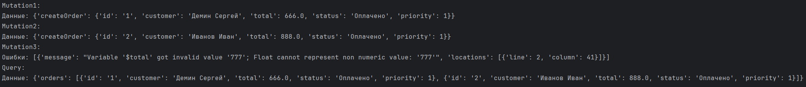
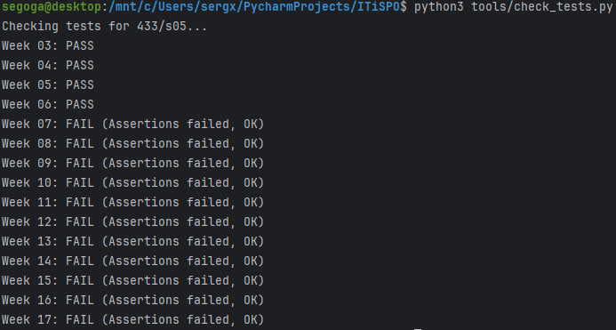

# Пишем GraphQL-клиент

## Задача
Мы умеем создавать сервер, но API бесполезен, пока им никто не пользуется. На этой неделе мы напишем простой клиент, который умеет делать запросы к GraphQL серверу.
Это может быть скрипт для автоматизации или часть другого микросервиса.

## Моя вариант
`variants/433/s05/week-06.json`
Мне понадобится название ресурса и его поля.

## Что нужно сделать
1. **Реализовать функцию `build_payload`** в файле `app/client.py`:
   - Она должна принимать текст запроса (query) и переменные (variables).✅
   - Она должна возвращать словарь, готовый для отправки в JSON (стандартный формат GraphQL).✅
2. **Написать скрипт клиента**:
   - Используйте стандартную библиотеку `requests` или асинхронную `httpx`.✅
   - Сделайте запрос на получение данных (Query).✅
   - Сделайте запрос на создание данных (Mutation).✅
3. **Обработать ответ**:
   - Если вернулись ошибки (`errors`), выведите их.✅
   - Если вернулись данные (`data`), покажите их.✅

## Результаты работы:

