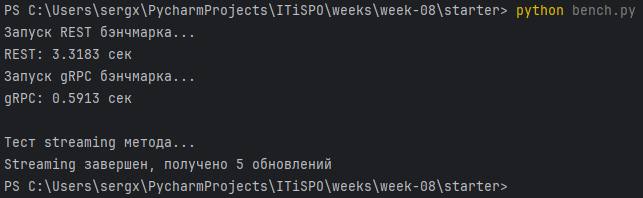
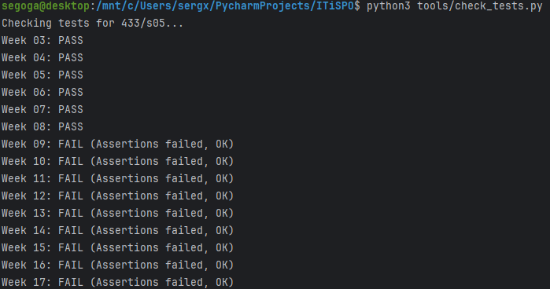

# gRPC Streaming и Бенчмарки

## Задача
Одна из киллер-фич gRPC — это стриминг. Сервер может отвечать не одним сообщением, а потоком данных. Это идеально для лент новостей, логов, биржевых котировок или передачи больших файлов.
Также пора проверить, действительно ли gRPC так быстр, как о нем говорят.

## Мой вариант
`variants/<GROUP>/<STUDENT_ID>/week-08.json`
Мне понадобится задание на streaming метод.

## Что нужно сделать
1. **Добавить Streaming метод**:
   - В `service.proto` добавьте новый метод с ключевым словом `stream` (Server Streaming).✅
   - Например: `rpc Subscribe(Request) returns (stream Update);`✅
   - Реализуйте этот метод на сервере: он должен возвращать итератор или использовать `yield` для отправки нескольких сообщений.✅
2. **Сравнить REST и gRPC**:
   - Напишите простой скрипт, который делает 1000 запросов к вашему REST сервису (из 1-2 недели) и 1000 запросов к gRPC сервису (Unary метод).✅
   - Замерьте время выполнения.✅
3. **Записать результаты**:
   - В файл `bench/results.md` запишите полученные цифры и ваши выводы.✅

## Результаты

