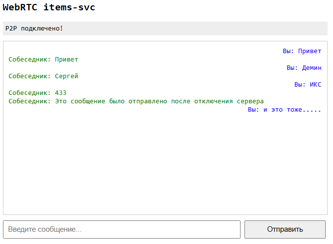
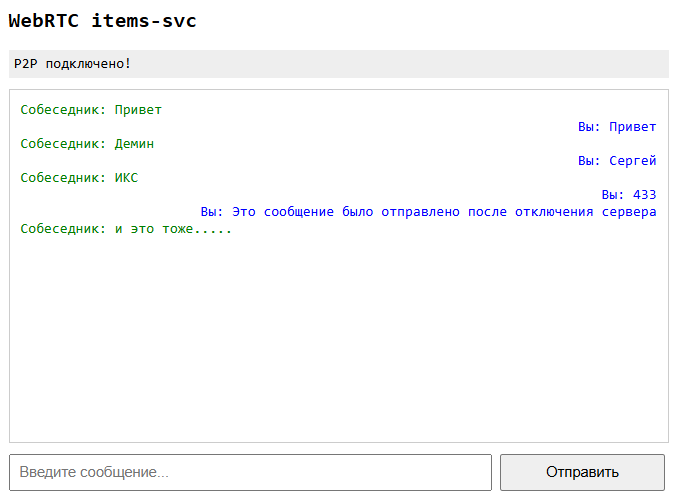
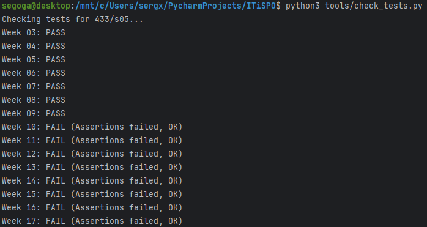

# WebRTC и P2P коммуникация

## Задача
До сих пор все наши коммуникации шли через сервер. Клиент -> Сервер -> Клиент. Но что, если мы хотим передать гигабайт видео? Или сделать видеочат без задержек? Гнать трафик через сервер дорого и долго.
На этой неделе мы строим **WebRTC** соединение: браузеры будут общаться напрямую друг с другом (Peer-to-Peer).

## Мой вариант
`variants/433/s05/week-09.json`
Мне понадобится название проекта для заголовка.

## Что нужно сделать
1. **Signaling Server**:
   - WebRTC нужен способ "познакомить" два браузера. Они должны обменяться технической информацией (SDP, ICE candidates).✅
   - Реализуйте простой WebSocket сервер (на FastAPI или `websockets`), который просто пересылает сообщения от одного клиента другому.✅
2. **Клиентская часть**:
   - В `client/index.html` напишите JavaScript код.✅
   - Используйте `RTCPeerConnection`.✅
   - Создайте Data Channel для передачи текстовых сообщений (чат).✅
3. **Проверка**:
   - Откройте две вкладки браузера.✅
   - Убедитесь, что сообщения из одной вкладки появляются в другой *мгновенно* и (в идеале) не нагружают сервер (после установления соединения).✅

## Результаты

