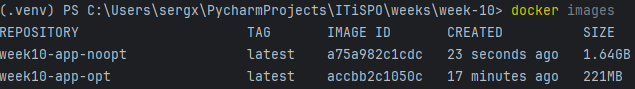
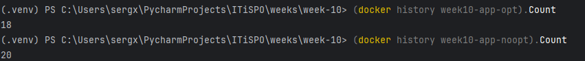
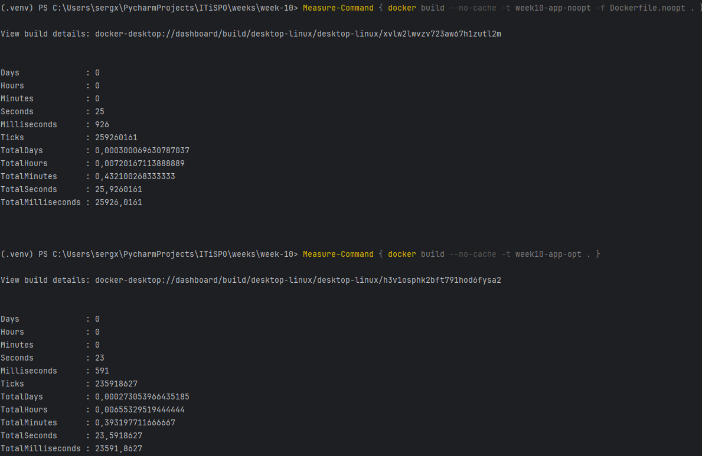

# Отчет по Docker

## Сводная таблица по сравнению Docker образов

|     Параметр     |                   Неоптимизированный                   |            Оптимизированный            |              %              |
|:----------------:|:------------------------------------------------------:|:--------------------------------------:|:---------------------------:|
|  Размер образа   |                   1.64 GB (1640 MB)                    |                 221 MB                 |  13.48 (В 7.42 раз меньше)  |
| Количество слоев |                           20                           |                   18                   |   90 (в 0.90 раза меньше)   |
|   Время сборки   |                      23.6 секунды                      |              25.9 секунды              | 91.12 (в 0.91 раза быстрее) |
|      Сборка      | docker build -t week10-app-noopt -f Dockerfile.noopt . |    docker build -t week10-app-opt .    |              -              |
|      Запуск      |        docker run -p 8197:8197 week10-app-noopt        | docker run -p 8197:8197 week10-app-opt |              -              |

size
layer

