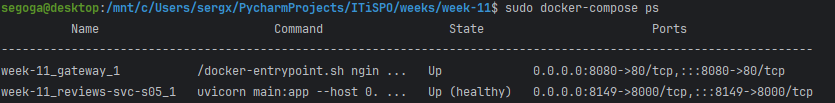
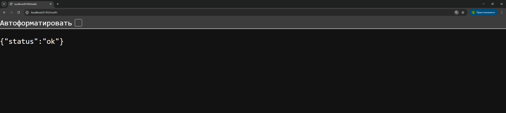
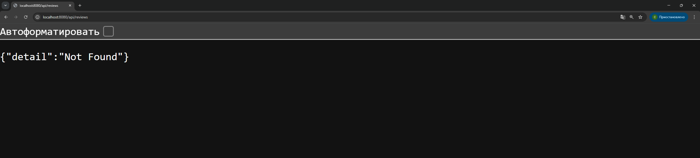
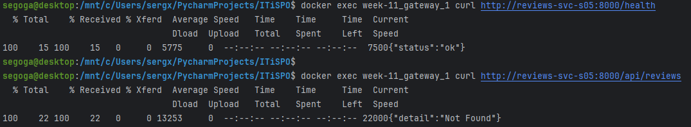
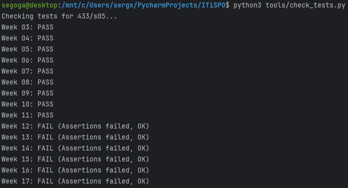

# Оркестрация для бедных (Docker Compose)

## Задача
Запускать каждый контейнер отдельной командой `docker run` — это мучение, особенно если их пять штук и они должны видеть друг друга по сети.
На этой неделе мы освоим **Docker Compose** — инструмент, который позволяет описать всю вашу систему в одном YAML-файле и запустить её одной командой.

## Мой вариант
`variants/433/s05/week-11.json`
Мне понадобится имя главного сервиса (`service.name`).

## Что нужно сделать
1. **Написать docker-compose.yml**:
   - Опишите сервис вашего приложения (из прошлых недель).✅
   - Добавьте второй сервис (например, базу данных Postgres или Redis, или просто заглушку).✅
   - Добавьте Gateway (Nginx) из 3-й недели.✅
2. **Настроить сеть**:
   - Создайте пользовательскую сеть (`networks`), чтобы сервисы могли общаться по именам (например, `http://app:8000`), а не по IP.✅
3. **Настроить порядок запуска**:
   - Используйте `depends_on` и `healthcheck`. Приложение не должно стартовать (или принимать трафик), пока база данных не скажет "я готова".✅
4. **Запустить**:
   - `docker-compose up --build`✅

## Результаты

---

---
