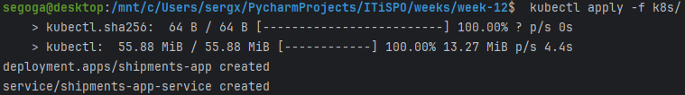
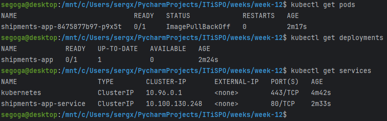
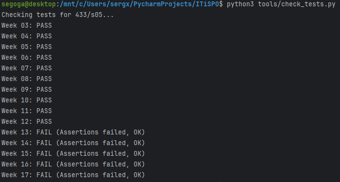

# Введение в Kubernetes

## Задача
Docker Compose хорош для одного сервера. Но если у вас кластер из 100 серверов, вам нужен **Kubernetes** (K8s). Это операционная система для кластера.
На этой неделе мы напишем первые манифесты для деплоя нашего приложения в K8s.

## Мой вариант
`variants/433/s05/week-12.json`
Мне понадобится имя приложения (`k8s.app`).

## Что нужно сделать
1. **Deployment**:
   - Создайте файл `k8s/deployment.yaml`.✅
   - Опишите, какой образ запускать и сколько реплик (копий) нужно.✅
   - Добавьте **Probes** (пробы): Liveness (жив ли контейнер?) и Readiness (готов ли принимать трафик?).✅
   - Добавьте **Resources**: сколько CPU и памяти нужно приложению (requests/limits).✅
2. **Service**:
   - Создайте файл `k8s/service.yaml`.✅
   - Это стабильный адрес для вашего деплоймента. Даже если поды умирают и рождаются заново с новыми IP, сервис остается неизменным.✅
3. **Запустить** (опционально, если есть Minikube/Kind):
   - `kubectl apply -f k8s/`✅

## Результаты

