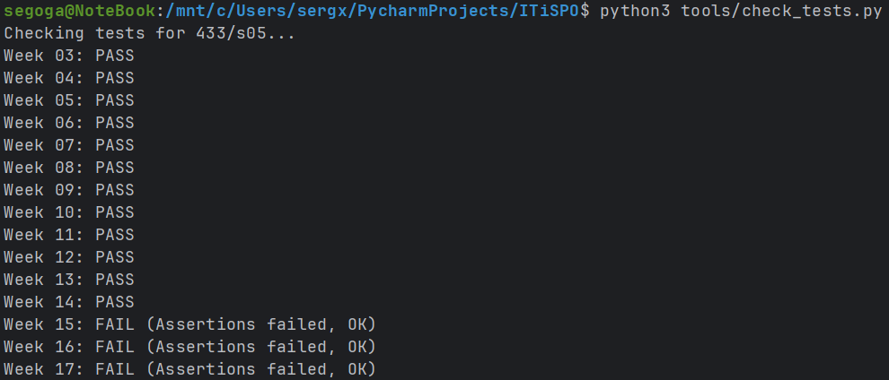

# Автоматизация (CI/CD)

## Задача
Ручная сборка и деплой — это путь к ошибкам и боли. "Я забыл запустить тесты", "Я собрал не ту ветку", "Я перезатер прод образом с дева".
На этой неделе мы настроим **CI/CD Pipeline** (Конвейер). Робот будет делать всю грязную работу за нас.

## Мой вариант
`variants/433/s05/week-14.json`
Мне понадобится название образа для публикации.

## Что нужно сделать
В файле конфигурации CI (это может быть `.github/workflows/main.yml`, `.gitlab-ci.yml` или псевдокод в `README.md`, если у вас нет доступа к раннерам):
1. **Lint**: Проверить код линтером (flake8/pylint).✅
2. **Test**: Запустить тесты (pytest).✅
3. **Build**: Если тесты прошли — собрать Docker образ.✅
   - Используйте кэширование слоев, чтобы не ждать вечность.✅
4. **Publish**: Опубликовать образ в Registry (Docker Hub) или сохранить как артефакт.✅

Для задания достаточно описать этот процесс в файле (мы не требуем реального CI раннера, но если есть возможность — настройте GitHub Actions).

## Результаты

