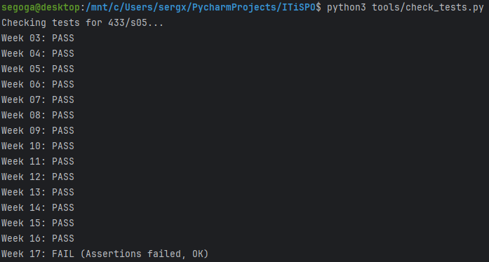

# Безопасность (Security Audit)

## Задача
Вы написали код, он работает быстро. Но безопасен ли он?
На этой неделе мы меняем шляпу разработчика на шляпу хакера (этичного!). Вам нужно провести аудит безопасности вашего (или чужого) приложения.

## Мой вариант
`variants/433/s05/week-16.json`

## Что нужно сделать
1. **Составить чек-лист**:
   - Опираясь на OWASP Top 10 (Web или Mobile), составьте список из 10-15 проверок.✅
   - Например: "Хранятся ли пароли в открытом виде?", "Есть ли защита от SQL Injection?", "Проверяется ли JWT токен?".✅
2. **Провести аудит**:
   - Пройдитесь по чек-листу для вашего проекта.✅
   - Попробуйте "взломать" себя: отправить SQL-инъекцию, подделать токен, перехватить трафик.✅
3. **Написать отчет**:
   - В файле `audit.md` зафиксируйте найденные уязвимости (или их отсутствие) и рекомендации по исправлению.✅
   - "Уязвимость: Пароль в базе текстом. Риск: Критический. Решение: Хэшировать с солью (Argon2/bcrypt)".✅

## Результаты
 