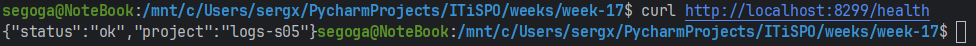
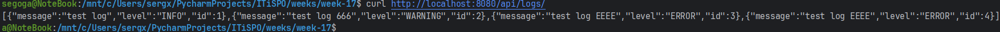
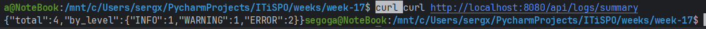
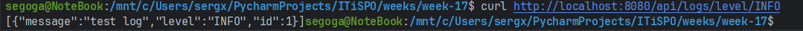
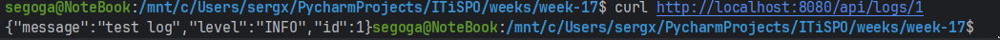
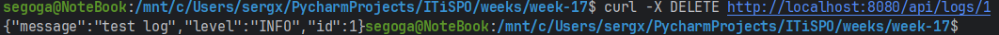
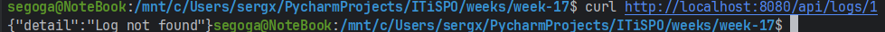
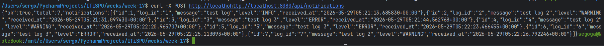
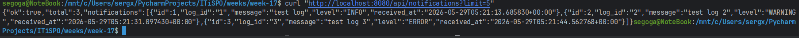

# Архитектура logs-s05

## Сервисы
1. gateway - внешняя точка входа.
2. logs-svc-s05 - основной сервис для работы с логами.
3. log-notifier - внутренний сервис уведомлений.

## Взаимодействие
- Клиент отправляет запросы в gateway.
- gateway передает REST-запросы в logs-svc-s05.
- logs-svc-s05 после создания лога вызывает log-notifier по gRPC.

## Диаграмма взаимодействия
```text
Клиент
  |
  v
gateway
  |
  v
logs-svc-s05
  |
  v
log-notifier
```

## Данные
- Логи хранятся в памяти приложения.
- Отдельная база данных не используется.

## Протоколы
- REST используется для внешнего API.
- gRPC используется для связи между logs-svc-s05 и log-notifier.

## Развертывание
- Локальный запуск сделан через docker compose.
- Для Kubernetes есть отдельные прототипные манифесты.


## HTTP-запросы
### 1. Health check logs-сервиса
```
curl http://localhost:8299/health
```


### 2. Создать лог
```
curl -X POST http://localhost:8080/api/logs/ -H "Content-Type: application/json" -d "{\"message\":\"test log\",\"level\":\"INFO\"}"
```

### 3. Получить все логи
```
curl http://localhost:8080/api/logs/
```


### 4. Получить сводку по логам
```
curl http://localhost:8080/api/logs/summary
```


### 5. Получить логи по уровню
```
curl http://localhost:8080/api/logs/level/INFO
```


### 6. Получить лог по id
```
curl http://localhost:8080/api/logs/1
```


### 7. Удалить лог по id
```
curl -X DELETE http://localhost:8080/api/logs/1
```


### 7.5. Проверка, что лог удален
```
curl http://localhost:8080/api/logs/1
```


### 8. Получить историю уведомлений
```
curl http://localhost:8080/api/notifications
```


### 9. Получить последние N уведомлений
```
curl "http://localhost:8080/api/notifications?limit=5"
```
